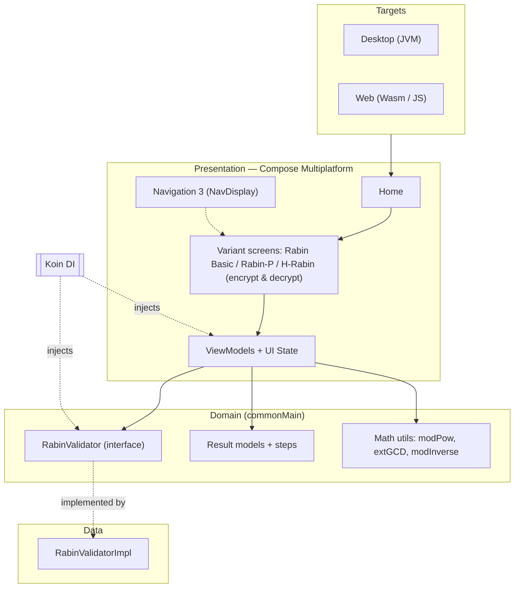

<div align="center">

# Rabin 🔢🔐

**An interactive, multiplatform playground for the Rabin cryptosystem — encrypt, decrypt, and follow every step of three Rabin variants.**

[](https://kotlinlang.org/)
[](https://www.jetbrains.com/compose-multiplatform/)
[](https://kotl.in/wasm/)
[](https://www.java.com/)
[](https://insert-koin.io/)
[](./LICENSE)

### 🌐 [**Try the live demo →**](https://rabin-cipher.pages.dev/)

</div>

Rabin is a **Kotlin Multiplatform** + **Compose Multiplatform** application that
turns the **Rabin cryptosystem** into a hands-on learning tool. Enter your own
primes and message, then watch the app encrypt or decrypt while printing every
intermediate step — modular exponentiation, Chinese Remainder Theorem
recombination, candidate roots, and more. It implements **three variants** of
Rabin (Basic, Rabin-P, and H-Rabin) and runs from a single shared codebase on the
Web and Desktop.

---

## Table of Contents

- [Overview](#overview)
- [Features](#features)
- [Algorithms](#algorithms)
- [Tech Stack](#tech-stack)
  - [Core](#core)
  - [UI & Navigation](#ui--navigation)
  - [Architecture & DI](#architecture--di)
  - [Build & Tooling](#build--tooling)
- [Architecture](#architecture)
- [How It Works](#how-it-works)
  - [Input Validation](#input-validation)
  - [Step-by-Step Output](#step-by-step-output)
- [Project Structure](#project-structure)
- [Getting Started](#getting-started)
  - [Live Demo](#live-demo)
  - [Prerequisites](#prerequisites)
  - [Build & Run](#build--run)
- [Platform Notes](#platform-notes)
- [CI/CD](#cicd)
- [License](#license)

---

## Overview

The **Rabin cryptosystem** is a public-key scheme whose security rests on the
difficulty of integer factorization — closely related to RSA, but built around
computing **square roots modulo a composite number**. Its defining quirk is that
decryption yields **multiple candidate plaintexts**, which makes it a great
teaching example for modular arithmetic and the Chinese Remainder Theorem.

Rabin makes these ideas tangible. Instead of treating the math as a black box,
every operation is broken down into a readable list of steps, so students and
curious developers can see exactly how keys, ciphertexts, and candidate roots are
derived. The entire application logic — UI, ViewModels, validation, and the
cryptographic routines — lives in shared Kotlin, with only tiny platform-specific
pieces (clipboard, platform info) implemented per target.

## Features

| Feature | Description |
|---|---|
| **🔐 Three Rabin variants** | Switch between **Rabin Basic**, **Rabin-P**, and **H-Rabin** from the home screen. |
| **🔄 Encrypt & Decrypt** | Dedicated encryption and decryption flows for each variant. |
| **🧮 Step-by-step breakdown** | Each operation prints its intermediate steps (modular exponentiation, CRT, candidate roots) for learning. |
| **✅ Strict input validation** | Real-time checks ensure primes are valid (prime and ≡ 3 mod 4) and messages/ciphertexts fall within valid ranges. |
| **📋 Copy to clipboard** | One-tap copying of keys, ciphertexts, and results. |
| **🖥️ Multiplatform** | One shared codebase running on the Web (Wasm & JS) and Desktop (Linux/Windows/macOS). |

## Algorithms

Rabin implements three flavors of the cryptosystem, each with its own encrypt and
decrypt screen:

| Variant | Modulus | Key Idea | Decryption Output |
|---|---|---|---|
| **Rabin Basic** | `n = p · q` | Classic Rabin — ciphertext `c = m² mod n`. | **4 candidate** plaintexts (via CRT). |
| **Rabin-P** | single prime `p` | A simplified, deterministic variant; the message must be coprime with `p`. | A **single** recovered message. |
| **H-Rabin** | `n = p · q · r` | Extends Rabin to **three** primes for a larger modulus. | Multiple **candidate** plaintexts. |

> All primes (`p`, `q`, `r`) must be **prime** and **congruent to 3 (mod 4)** — the
> Blum-prime condition that makes square-root computation efficient.

## Tech Stack

### Core

- **Kotlin 2.2** Multiplatform — shared code across JVM (Desktop), JS, and Wasm.
- **Clean architecture** — `domain` (models + service interfaces), `data` (implementations), and `presentation` layers.
- **kotlinx.serialization** — serializable navigation keys.
- **kotlinx.coroutines** — asynchronous work (with the Swing dispatcher on Desktop).
- Custom **modular-arithmetic utilities** — `modPow`, extended GCD, and modular inverse implemented from scratch.

### UI & Navigation

- **Compose Multiplatform 1.10** — shared declarative UI with **Material 3**.
- **material3-window-size-class** — adaptive layout; the app targets large screens and shows a guidance screen on small/compact windows.
- **Navigation 3** (`NavDisplay`, `NavKey`) — type-safe, animated navigation between Home and the three variant screens.
- **material-icons-extended** — icon set; custom theme, typography, and color palette.

### Architecture & DI

- **Koin 4.2** — dependency injection: `koin-core`, `koin-compose`, `koin-compose-viewmodel`, and `koin-compose-navigation3` wire the validator service, ViewModels, and navigator.
- **Lifecycle ViewModel (Compose)** — one ViewModel per encrypt/decrypt screen with dedicated UI state holders.
- **expect/actual** — platform-specific clipboard and platform-info implementations.

### Build & Tooling

- **Gradle (Kotlin DSL)** with a centralized **version catalog** (`gradle/libs.versions.toml`).
- **Compose Desktop** — native installers: `.deb` (Linux), `.msi` (Windows), `.dmg` (macOS).
- **Compose Hot Reload** — fast desktop UI iteration.
- **GitHub Actions** — automated Wasm web build & deployment (see [CI/CD](#cicd)).

## Architecture

Rabin follows a **clean, layered architecture**. Compose screens delegate to
**ViewModels**, which call into a **`RabinValidator`** service (and the shared math
utilities) defined in the domain layer and implemented in the data layer. Koin
provides every dependency, and Navigation 3 drives screen transitions.



## How It Works

### Input Validation

Before any computation, inputs are validated in real time by `RabinValidator`:

- **Primes** (`p`, `q`, `r`) must be positive, **prime**, and **≡ 3 (mod 4)**.
- **Messages** must be positive and within the valid range for the chosen variant
  (e.g. `m < n` for Basic/H-Rabin; `m < p²/2` and coprime with `p` for Rabin-P).
- **Ciphertexts** are bounded by the modulus and, for Rabin-P, must be coprime with `p`.

Each check returns a clear, user-facing reason when it fails, so invalid keys or
messages are caught immediately.

### Step-by-Step Output

Every encrypt/decrypt result carries a `steps` list that records the intermediate
math — modulus computation, modular exponentiation, CRT recombination, and the
resulting candidate roots. This turns each run into a transparent, teaching-friendly
walkthrough rather than an opaque result.

## Project Structure

A high-level view — almost everything is shared in `commonMain`, with thin
platform source sets for `expect`/`actual` implementations:

```text
rabin/
├─ composeApp/
│  └─ src/
│     ├─ commonMain/
│     │  ├─ kotlin/…/domain        # Result models + validator interface
│     │  ├─ kotlin/…/data          # RabinValidator implementation
│     │  ├─ kotlin/…/presentation  # Screens (home + 3 variants), ViewModels, navigation, theme, components, utils
│     │  ├─ kotlin/…/di            # Koin modules
│     │  └─ composeResources/       # Fonts & drawables
│     ├─ jvmMain/     # Desktop entry point + actual impls (clipboard, platform)
│     ├─ jsMain/      # Web (JS) actual impls
│     ├─ wasmJsMain/  # Web (Wasm) actual impls
│     └─ webMain/     # Shared web entry point
├─ gradle/             # Version catalog (libs.versions.toml) & wrapper
├─ .github/workflows/  # CI: build & deploy Wasm web app
└─ build.gradle.kts
```

## Getting Started

### Live Demo

The fastest way to try Rabin is the hosted web build:

[**➤ rabin-cipher.pages.dev**](https://rabin-cipher.pages.dev/)

> 💡 Rabin is designed for **large screens**. Use a desktop browser (or a maximized
> window) — on small/compact screens the app shows a guidance screen instead.

### Prerequisites

- **JDK 21** (for building the Desktop and Web targets).
- **IntelliJ IDEA** / **Android Studio** with Kotlin Multiplatform tooling (recommended).

### Build & Run

Clone the repository:

```shell
git clone https://github.com/andreasmlbngaol/rabin-cipher.git
cd rabin-cipher
```

**Desktop (JVM)**

```shell
# macOS / Linux  (ensure gradlew is executable: chmod +x gradlew)
./gradlew :composeApp:run

# Windows
.\gradlew.bat :composeApp:run
```

Build native desktop installers:

```shell
./gradlew packageDeb     # Linux   -> .deb
.\gradlew packageMsi     # Windows -> .msi
./gradlew packageDmg     # macOS   -> .dmg
```

**Web**

```shell
# Wasm target (faster, modern browsers)
./gradlew :composeApp:wasmJsBrowserDevelopmentRun

# JS target (supports older browsers)
./gradlew :composeApp:jsBrowserDevelopmentRun
```

On Windows, use `.\gradlew.bat` in place of `./gradlew`.

## Platform Notes

- **Web (Wasm)** is the primary distribution and powers the live demo — fast and best on modern browsers.
- **Web (JS)** is provided as a fallback for older browsers.
- **Desktop (JVM)** runs on Linux, Windows, and macOS, and can be packaged into native installers.
- The UI is optimized for **large screens**; compact windows display a guidance screen.

## CI/CD

Releases of the web app are automated with **GitHub Actions**
(`.github/workflows/deploy.yml`). On every push to `master` (ignoring
docs-only changes), the workflow:

- sets up **JDK 21** (Temurin);
- builds the production Wasm distribution with `./gradlew :composeApp:wasmJsBrowserDistribution`; and
- publishes the static output so the latest version is available online.

## License

This project is licensed under the **MIT License** — see the [LICENSE](./LICENSE)
file for details. You are welcome to use, study, and build upon it, provided the
original copyright and attribution are preserved.

© 2025 andreasmlbngaol
